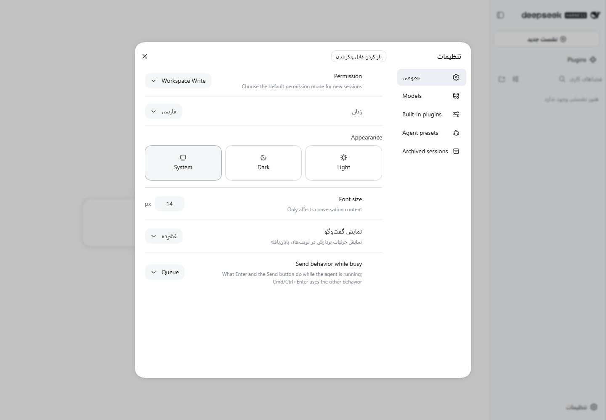

# Persian for DeepSeek Harness

[فارسی](README.fa.md) · Independent community plugin by [MiRHaDi](https://github.com/MiRHaDi)

Adds **فارسی** to the Web language selector, translates **395 strings across seven namespaces**, and enables right-to-left layout while Persian is selected. Code, keyboard shortcuts, terminal and editor containers remain left-to-right. The plugin uses the public locale API and has no runtime npm dependencies.



The conversation translations are **unreleased** on this branch. Release v0.1.0 contains the original 240 strings; the screenshot above documents that release. To test this branch, run `npm ci`, `npm test`, and `npm pack`, then install the resulting local tarball.

## Install

Tested with **DeepSeek Harness 0.1.6-alpha.2**, Node 24.15.0 and installed Google Chrome 153.0.8010.52 on Windows. This is an alpha API; earlier releases are not supported and later compatibility is not guaranteed. Use that DSH version for the published v0.1.0 release. The unreleased branch tarball was additionally installed and removed with the official CLI on **DSH 0.2.0-rc.2**, and its Web UI was tested with Chrome 154.0.8037.98. The published v0.1.0 asset was not retested on that newer host. The plugin does not install or upgrade DSH.

Download `dsh-persian-rtl-0.1.0.tgz` from [Releases](https://github.com/MiRHaDi/dsh-persian-rtl/releases). With the Web profile already created, run:

```sh
dsh plugin --profile web add ./dsh-persian-rtl-0.1.0.tgz
dsh --profile web --no-open
```

Open the local address printed by DSH, then select **Settings → General → Language → فارسی**. An unset language preference also follows a Persian browser locale such as `fa-IR`. Your explicit preference takes priority. No API key is needed to select the language; model requests still require the normal provider setup.

For an isolated trial, set `DSH_HOME` to an empty directory before starting DSH. See the official [profile and plugin guide](https://github.com/deepseek-ai/deepseek-harness/blob/master/docs/user/develop/basic/publish.md). The release tarball contains the built client and does not require a build script at installation.

Remove with `dsh plugin --profile web remove dsh-persian-rtl`, then reload the page. Disposal removes the dictionaries, selector entry, listener and stylesheet. When leaving Persian, the previous document direction is restored unless another owner has changed it. Language and preference persistence belong to DSH.

## Coverage and limits

| Namespace | Strings | Coverage at pinned revision |
|---|---:|---|
| `common` | 37 | Complete |
| `settings.locale` | 1 | Complete |
| `sidebar` | 5 | Complete |
| `settings` | 29 | Complete |
| `workspace` | 64 | Complete |
| `chat` | 104 | Complete |
| `conversation` | 155 | Complete |

Other namespaces use DSH's English fallback. This is **not a complete translation of the application**: onboarding, provider configuration and several settings panels remain English. The screenshot intentionally shows this scope. Locale-specific date conversion, Persian digits, speech, and the terminal UI are not implemented. Dates retain the upstream calendar. Singular and plural count templates preserve their parameters and use natural Persian count nouns.

RTL uses document direction and scoped CSS, not string reversal or inserted directional control characters. Code containers (`pre`, `code`, `kbd`, `samp`, xterm, Monaco and CodeMirror) use LTR isolation. Paragraphs and textareas use `unicode-bidi: plaintext` to handle mixed Persian and Latin text. These selectors are not proof that every third-party renderer supports RTL; report a reproducible component when one does not.

## Validation

```sh
npm ci
npm run build
npm test
```

Nine automated tests per runtime (27 executions across the compatibility matrix) cover every dictionary key and placeholder against a pinned upstream fixture, real published `LocaleRuntime` behavior, `fa-IR` negotiation, English fallback, repeated language changes, unload/reload, restoration of direction, and listener disposal. The runtime tests load the published client factory; unused rendering dependencies throw if called, so they do not pretend to test the settings component.

The original v0.1.0 plugin was also installed through the real `dsh plugin` command and exercised in the actual Web app using headless system Chrome: Settings language changes `fa → en → fa`, `lang`/`dir`, and zero page errors. LTR code/editor CSS was checked with temporary DOM fixtures under the live plugin; these were removed before the screenshot. No model request, production account or user workspace was used. Full conversation execution and every viewport/theme were not tested.

For the browser smoke, install Playwright 1.62.1 separately or locally without saving it, set `DSH_TEST_URL` to your isolated running instance's local authenticated URL and run `node test/browser.cjs`. This opens only headless Chrome. Keep that URL private. The test changes only the test instance's language and onboarding preferences. Use the upstream browser-picker overlay when starting an automated test instance.

The conversation regression test exercises all 155 messages at four counts (620 cases), mixed Persian/Latin parameters, and English restoration after unloading. Queueing and steering retain distinct labels.

The unreleased conversation pack was also loaded into the actual DSH 0.1.6-alpha.2 Web app using a local plugin overlay and headless installed Chrome 153.0.8010.54. A mixed Persian/Latin draft survived `fa → en → fa`; Send changed language; desktop (1280×900) and narrow (360×780) captures had no page errors or document overflow. No message was sent. A follow-up on Chrome 154.0.8037.98 reproduced and fixed clipping of the preset name: the Persian workspace/preset row now wraps using the public slot identity. The English row retains its original layout. The standard preset label fits at 320, 360, 768, and 1280 pixels, and the narrow preset menu remains operable. Custom names can still use the host’s normal ellipsis when a single label is too long.

To repeat the conversation smoke, use an isolated instance with onboarding completed and an existing test workspace. Install Playwright separately, set `DSH_TEST_URL` (private local authenticated URL), `DSH_TEST_WORKSPACE` (the workspace name), and optionally `DSH_TEST_OUTPUT` (capture directory), then run `node test/browser-conversation.cjs`. It refuses a nonempty draft, never sends it, and clears the test draft on success.

The 395-key coverage table refers to the original pinned alpha revision. Released 0.2.0-rc.2 and 0.2.1-alpha.1 have 748 and 750 keys respectively across these seven namespaces: 382 still have Persian translations, 13 old keys were removed, and 366/368 new keys fall back to English. The conversation namespace changed one existing message and removed two old keys; its remaining new keys are untranslated.

The published **LocaleRuntime API and English dictionary contracts** are tested against three exact versions:

| Test target | Locale package | Source revision |
|---|---|---|
| baseline | 0.1.6-alpha.2 | `ddefc45fbc7f8e46dd73185e68295696d1297887` |
| rc | 0.2.0-rc.2 | `639ed015397290b3745d163aafe02ffee4aa3f84` |
| alpha | 0.2.1-alpha.1 | `5badb15009ae1756c3afe0ae0cef1faafc290ccc` |

This checks every current message for matching placeholders or English fallback, and restores the selected version's English dictionary on unload. For **0.2.1-alpha.1**, this is still API/dictionary validation only. For **0.2.0-rc.2**, a separate actual-app check installed the local branch tarball with `dsh plugin --profile web add`, exercised the Web UI, removed it with `dsh plugin --profile web remove`, and relaunched successfully without the Persian selector entry or RTL stylesheet.

Each newer runtime has its own lockfile under `test/runtimes/` because its Cordis peer version differs. Do not combine them with `--force` or `--legacy-peer-deps`. Install a fixture with `npm ci --ignore-scripts --prefix test/runtimes/rc`, then run `npm test` with `DSH_TEST_RUNTIME=rc` in the environment (or `alpha` for the other fixture). Tests assert the loaded version to prevent silently falling back to the baseline. CI runs all three. At the October 4 audit, the locale package's npm `latest` tag pointed to the older 0.0.1-rc.1, so these tests pin versions rather than following that tag.

English fixture source: DeepSeek Harness commit `ddefc45fbc7f8e46dd73185e68295696d1297887`. To update, compare the seven source dictionaries listed in `test/upstream-sources.json`; preserve placeholder names and multiplicity. Translation and code were prepared with AI assistance and reviewed through the validation above; Persian speaker feedback is welcome.

## Contributing

Report missing translations with a namespace/key or a screenshot without credentials. For layout bugs, include DSH/browser versions and minimal mixed-language text. PRs should include a regression test and describe the user-visible behavior. This is a community package, not an official DeepSeek product or a claim of membership in its core team.

### Current release-candidate installation smoke

On October 4 the branch package at `62501c4` (local tarball SHA256 `0856ee6a9976805ed8aab18a0f7754cbbcaf468bce2f5ce00bd4251640955700`) was installed into an isolated DSH 0.2.0-rc.2 Web profile. Chrome 154.0.8037.98 confirmed language switching, an unchanged mixed-language draft, the preset menu, and widths 320/360/768/1280 without page errors or document overflow. The same browser smoke was rerun on 0.1.6-alpha.2.

The smoke now confirms saved language in independent browser contexts with the opposite browser locale before capturing screenshots. The language row can show an optimistic value before Host settings settle; the older smoke could capture an English frame between Persian assertions. Language and direction are checked around captures and at every tested width. This strengthens the test; it does not replace or intercept the Host's locale persistence implementation.

After CLI removal and relaunch on the RC, English fallback worked even with a Persian browser preference, the Persian selector entry and stylesheet were absent, and the profile no longer referenced the plugin. No model request was sent. These checks cover installation, removal and the tested Web controls, not every agent tool or a full model conversation. Machine-readable results are in `docs/rc-web-result.json`, `docs/rc-uninstall-result.json`, and `docs/baseline-web-result.json`.
